# Machine Learning, From Intuition to Practice

A chapter-by-chapter machine learning course in Jupyter notebooks, written for someone
who knows a little Python and nothing about ML.

The goal is **not** to memorise algorithms. The goal is that when you meet a problem
nobody has shown you before - in an exam, an interview, a bug, or a real project - you
already know which questions to ask:

> What is the actual problem? Is machine learning even the right tool?
> What does one row represent? What is the target? What will I actually know at
> prediction time? What is the simplest baseline? How should I split the data?
> Is there leakage? Which metric matches the real cost of a mistake? Which model family
> fits? Am I underfitting or overfitting? Where does the model fail? What do I try next?
> How honest am I being about uncertainty?

## How the course teaches

Every important idea is built in the same order:

1. a familiar human situation
2. a tiny table of 3-10 rows you can hold in your head
3. a prediction you make **before** running the code
4. a picture
5. one example worked out by hand, with real numbers
6. the notation, introduced only after the numbers
7. a small from-scratch implementation, when it helps
8. the standard library version
9. a realistic dataset
10. a **failure lab** where the method is deliberately broken, and diagnosed

Maths grows slowly, on a ladder from counting to gradients. No formula appears before
the numbers it summarises.

## The algorithm map

Every method this course teaches, where it sits, and which chapter builds it.

The top-level split is the one Andrew Ng uses and it is the right one, because it is a question about
**your data** rather than about the algorithms: *do you have recorded answers, and for how many rows?*
Chapter 00-03 walks the decision; this is the map it produces.

```mermaid
flowchart TD
    Q{"Do you have recorded outcomes?"}

    Q -->|"for most rows"| SUP["SUPERVISED"]
    Q -->|"for a few rows"| SEMI["Semi-supervised, active learning &#183; 12-01"]
    Q -->|"for a related problem"| TRANS["Transfer learning &#183; 10-12, 11-05"]
    Q -->|"no, but I can hide part of the data"| SELF["Self-supervised &#183; 10-12, 12-03"]
    Q -->|"no, I want structure"| UNSUP["UNSUPERVISED"]
    Q -->|"no, they come from acting"| RL["Reinforcement, bandits &#183; 12-05"]

    SUP --> REG["Regression &#183; module 05"]
    SUP --> CLF["Classification &#183; module 06"]
    SUP --> TS["Forecasting &#183; module 09"]

    UNSUP --> CLU["Clustering &#183; 08-03 to 08-06"]
    UNSUP --> DIM["Dimensionality reduction &#183; 08-07, 08-08"]
    UNSUP --> ANO["Anomaly detection &#183; 08-08"]

    classDef q fill:#ffffff,stroke:#333333,color:#111111
    classDef task fill:#0072B2,stroke:#013a5c,color:#ffffff
    classDef leaf fill:#e8f1f8,stroke:#0072B2,color:#0b2233
    classDef other fill:#D55E00,stroke:#6e3000,color:#ffffff
    class Q q
    class SUP,UNSUP task
    class REG,CLF,TS,CLU,DIM,ANO leaf
    class SEMI,TRANS,SELF,RL other
```



*The diagram stops at the task. Which algorithm to reach for within a task is the table below —
and it is a different question, decided by the shape of your data rather than by the shape of your
labels.*

### Where each algorithm lives

Read the last two columns together: **what shape a model can express** decides what it can learn, and
**where it breaks** decides whether you should use it. Neither is about accuracy.

#### Baselines — every model must beat one *(04-02)*

| Method | Task | Chapter | The point |
|---|---|---|---|
| Mean / median constant | regression | 00-01, 05-01 | The median minimises MAE, the mean minimises MSE |
| Majority class | classification | 06-01 | On imbalanced data it is often 95%+ accurate and useless |
| Naive / seasonal naive | forecasting | 09-04 | "Same as last week" is genuinely hard to beat |

#### Linear family — a weighted sum of the inputs

| Algorithm | Task | Chapter | Can express | Breaks when |
|---|---|---|---|---|
| Linear regression (OLS) | regression | 05-02, 05-03 | A flat plane through the features | The truth is curved, or features interact |
| Polynomial / interaction features | regression | 05-07 | Curves and interactions, still fitted linearly | Degree grows — it fits the noise |
| Ridge | regression | 05-09 | Same as OLS, coefficients shrunk | Needs scaled features, and it keeps every one |
| Lasso / Elastic Net | regression | 05-09 | Same, with some coefficients driven to zero | Arbitrary choice among correlated features |
| Logistic regression | classification | 06-02 | One straight decision boundary | Classes not linearly separable |
| Naive Bayes | classification | 06-10 | Class boundaries under an independence assumption | Features are strongly dependent |

#### Distance and margin — geometry in feature space

| Algorithm | Task | Chapter | Can express | Breaks when |
|---|---|---|---|---|
| k-nearest neighbours | both | 06-10 | Any shape, memorised locally | Features unscaled, or many dimensions (08-02) |
| SVM, linear | classification | 06-10 | A maximum-margin straight boundary | Same limit as any linear boundary |
| SVM, kernel (RBF) | classification | 06-10 | Highly flexible curved boundaries | Slow past ~10k rows; hard to interpret |

#### Trees and ensembles — axis-aligned boxes

| Algorithm | Task | Chapter | Can express | Breaks when |
|---|---|---|---|---|
| Decision tree | both | 05-10, 06-11 | Rectangular regions, interactions for free | One tree overfits badly; unstable |
| Random forest | both | 05-10, 06-11 | Many trees averaged — lower variance | Cannot extrapolate beyond the training range |
| Gradient boosting | both | 05-11, 06-11 | Residuals fitted repeatedly; usually the strongest on tabular data | Easy to tune dishonestly (07-04); needs early stopping |

#### Unsupervised

| Algorithm | Finds | Chapter | Assumes | Breaks when |
|---|---|---|---|---|
| k-means | k round clusters | 08-03 | Blobs of similar size; you know k | Elongated or unequal clusters; k is a guess |
| Hierarchical | a nesting of clusters | 08-04 | A linkage definition | Still needs a cut — k postponed, not removed |
| DBSCAN | dense regions, plus noise | 08-05 | One density scale | Clusters of differing density |
| Gaussian mixture | soft, elliptical clusters | 08-05 | Gaussian components | Non-elliptical shapes; k again |
| PCA | directions of most variance | 08-07 | Linear structure; scaled features | Variance ≠ meaning |
| t-SNE / UMAP | a 2-D neighbourhood map | 08-08 | Local structure matters most | **Distances on the plot are not real** |
| Isolation forest / LOF | unusual rows | 08-08 | "Unusual" is what you want | Unusual and *bad* are different things |

#### Time series

| Method | Chapter | Can express | Breaks when |
|---|---|---|---|
| Exponential smoothing | 09-06 | Level, trend, seasonality with three knobs | Multiple seasonalities; external drivers |
| ARIMA / SARIMA | 09-07 *(optional)* | Autocorrelation structure | Needs stationarity; unfriendly to extra features |
| Lags + a regression model | 09-08 | Anything the chosen model can express | Requires a complete index (01-05) or lags silently misalign |

#### Neural networks

| Architecture | Chapter | Built for | Cost |
|---|---|---|---|
| MLP | 10-04 *(NumPy)*, 10-05 *(PyTorch)* | Any smooth function, given enough data | Rarely beats boosting on tabular data |
| CNN | 10-09, 11-04 | Grids — images, spectrograms | Needs data volume or transfer learning |
| RNN / attention | 10-10 | Sequences | Recurrence is slow; attention is quadratic in length |
| Transformer | 10-11 | Sequences and sets, in parallel | Data- and compute-hungry; used via transfer |

#### Recommenders *(module 11)*

| Method | Chapter | Idea | Breaks when |
|---|---|---|---|
| Popularity | 11-06 | Recommend what most people like | Ignores the person — and is a hard baseline |
| Content-based | 11-06 | Items similar to what they liked | Needs item features; never surprises anyone |
| Collaborative filtering | 11-06 | People like you liked this | Cold start; feedback loops (11-07) |

### How to choose, in five questions

1. **Do I have recorded outcomes?** No means unsupervised, self-supervised, or a different problem.
2. **Is the target a number or a category?** *Is 7 nearer to 8 than to 2?* — 00-03.
3. **What is the simplest thing that could work?** Compute a baseline before anything else — 04-02.
4. **Is the data tabular?** Then start with a linear model for interpretability and gradient boosting
   for accuracy. Deep learning earns its place on text, images and audio — 10-12.
5. **What does a mistake cost, and which mistake?** This decides the metric and the threshold long
   before it decides the model — 05-04, 06-07.

> **The course's position on model choice:** no model family is universally best. Every table above
> has a "breaks when" column because that is the column that decides. A simple model with the right
> features and an honest evaluation beats a sophisticated one with neither, and it can be explained
> to the person whose decision it changes.

## Start here

New to the repo: read [GETTING_STARTED.md](GETTING_STARTED.md), then open
[notebooks/00_orientation/00-01_start_here.ipynb](notebooks/00_orientation/00-01_start_here.ipynb).

| File | What it is for |
|---|---|
| [GETTING_STARTED.md](GETTING_STARTED.md) | Install and run your first notebook |
| [CURRICULUM.md](CURRICULUM.md) | Every chapter, in order, with prerequisites |
| [PROGRESS.md](PROGRESS.md) | What is built, what is validated, what is next |
| [GLOSSARY.md](GLOSSARY.md) | Plain-language definitions of terms already introduced |
| [DECISIONS.md](DECISIONS.md) | Why this course chose these datasets, tools and orderings |
| [curriculum.yml](curriculum.yml) | The same chapter list, machine-readable |
| [data/README.md](data/README.md) | Every dataset: source, licence, target, unit of observation |

## Layout

```
notebooks/     the learner notebooks, grouped by module, numbered in learning order
  00_orientation/README.md    <- every module folder has its own README
  01_python_bridge/README.md     with its chapters, prerequisites, algorithms
  02_data_literacy/README.md     and what to skip if you are short of time
  ...
solutions/     full worked solutions, mirroring the notebooks/ tree
assessments/   cumulative end-of-module assessments
data/          dataset documentation and (locally) raw files - raw data is not committed
assets/        the animated figures the chapters embed - built by scripts/build_animations.py
scripts/       validation, dataset helpers, animations, and the module-README generator
_template/     the notebook template every chapter follows
```

**Module READMEs.** Each folder under `notebooks/` carries a README with that module's chapters, its
prerequisites and what it unlocks, the algorithms it introduces, the data it uses, and advice on what
to skip. They are generated from `curriculum.yml` by `scripts/build_module_readmes.py`, so the
completion marks stay accurate:

| | | | |
|---|---|---|---|
| [00 Orientation](notebooks/00_orientation/) | [01 Python bridge](notebooks/01_python_bridge/) | [02 Data literacy](notebooks/02_data_literacy/) | [03 Maths](notebooks/03_math_foundations/) |
| [04 Workflow](notebooks/04_workflow/) | [05 Regression](notebooks/05_regression/) | [06 Classification](notebooks/06_classification/) | [07 Evaluation](notebooks/07_evaluation/) |
| [08 Unsupervised](notebooks/08_unsupervised/) | [09 Time series](notebooks/09_time_series/) | [10 Neural networks](notebooks/10_neural_networks/) | [11 Applied domains](notebooks/11_applied_domains/) |
| [12 Other paradigms](notebooks/12_other_paradigms/) | [13 Responsible & production](notebooks/13_responsible_production/) | [14 Capstones](notebooks/14_capstones/) | |

Notebook files are named `MM-CC_slug.ipynb`: module number, chapter number inside the
module, so the learning order is the sort order.

## Rules this course holds itself to

- one central idea per notebook, 30-60 minutes
- every notebook runs top to bottom from a fresh kernel (`scripts/validate_notebooks.py`)
- preprocessing is fitted on training data only; the test set is untouched until the end
- every model is compared against a baseline that a non-ML person could have built
- no claim that one model is universally best
- synthetic data is always labelled as synthetic
